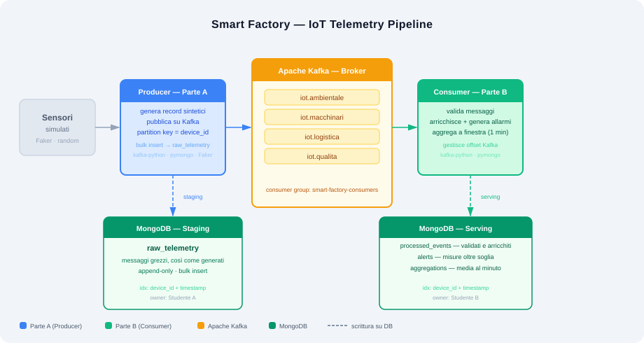

# Smart Factory — IoT Telemetry Pipeline

> ITS Corso Big Data — Esercitazione di coppia  
> Pipeline IoT in tempo reale: generazione, trasmissione e analisi di telemetria industriale

**Stack:** Python · Apache Kafka · MongoDB · kafka-python · pymongo · Faker

---

## Panoramica

Un impianto industriale dotato di sensori IoT genera continuamente misure di temperatura, vibrazione, consumo energetico, posizione e qualità produttiva.  
Il sistema è costruito attorno al pattern **Producer/Consumer** su Apache Kafka e al pattern **staging → serving** su MongoDB.



---

## Struttura del progetto

```
Esercitazione_SmartFactory_IoT_BigData/
│
├── contract/
│   └── data_contract.json       ← contratto dati condiviso (fonte di verità)
│
├── producer/
│   └── producer.py              ← Parte A: IoT Gateway / Producer
│
├── consumer/
│   └── consumer.py              ← Parte B: Stream Processor / Consumer
│
├── docs/
│   └── architecture.svg         ← diagramma dell'architettura
│
├── .env.example                 ← template variabili d'ambiente
├── requirements.txt
└── README.md
```

---

## Divisione dei ruoli

| Ruolo | Branch | Responsabilità |
|---|---|---|
| **Parte A — Producer** | `feature/part-a-producer` | Genera milioni di record sintetici, pubblica su Kafka, persiste il grezzo su MongoDB |
| **Parte B — Consumer** | `feature/part-b-consumer` | Legge da Kafka, valida, arricchisce, aggrega e persiste i dati elaborati su MongoDB |

---

## Contratto dati

Ogni messaggio Kafka rispetta questo schema. **Nessuna modifica senza accordo tra entrambe le parti.**

```json
{
  "device_id":  "A1:B2:C3:D4:E5:F6",
  "ambito":     "macchinari",
  "timestamp":  "2026-06-08T09:30:00Z",
  "tipo":       "temperatura_motore",
  "valore":     78.4,
  "unita":      "C",
  "reparto":    "Assemblaggio",
  "linea":      "L2"
}
```

**Topics:** `iot.ambientale` · `iot.macchinari` · `iot.logistica` · `iot.qualita`  
**Partition key:** `device_id`  
**Consumer group:** `smart-factory-consumers`

### Misure per ambito

| Ambito | Tipo | Unità | Range |
|---|---|---|---|
| ambientale | `temperatura_ambientale` | C | 15 – 45 |
| ambientale | `umidita` | % | 20 – 95 |
| ambientale | `co2` | ppm | 300 – 1500 |
| macchinari | `temperatura_motore` | C | 40 – 110 |
| macchinari | `vibrazione` | mm/s | 0.1 – 12.0 |
| macchinari | `rpm` | rpm | 500 – 4000 |
| macchinari | `consumo_energetico` | kWh | 10 – 200 |
| logistica | `posizione_lat` | deg | 45.40 – 45.50 |
| logistica | `posizione_lon` | deg | 9.10 – 9.20 |
| logistica | `rfid_lettura` | count | 0 · 1 |
| qualita | `pezzi_prodotti` | count | 0 – 500 |
| qualita | `scarti` | count | 0 – 80 |
| qualita | `esito_controllo` | bool | 0 · 1 |

### Soglie di allarme

| Tipo | Soglia |
|---|---|
| `temperatura_motore` | > 85.0 C |
| `vibrazione` | > 7.5 mm/s |
| `consumo_energetico` | > 150.0 kWh |
| `temperatura_ambientale` | > 40.0 C |
| `umidita` | > 85.0 % |
| `co2` | > 1000 ppm |
| `rpm` | > 3500 rpm |
| `scarti` | > 50 count |

---

## MongoDB

Database: `smart_factory`

| Collection | Owner | Contenuto |
|---|---|---|
| `raw_telemetry` | Parte A | Messaggi grezzi — staging |
| `processed_events` | Parte B | Messaggi validati e arricchiti — serving |
| `alerts` | Parte B | Misure oltre soglia |
| `aggregations` | Parte B | Media per `(device_id, tipo)` a finestra di 1 minuto |

---

## Setup

**Prerequisiti:** Python 3.10+ · Apache Kafka · MongoDB (forniti dal laboratorio)

```bash
git clone https://github.com/zozzy04/Esercitazione_SmartFactory_IoT_BigData.git
cd Esercitazione_SmartFactory_IoT_BigData

pip install -r requirements.txt

cp .env.example .env
# Imposta KAFKA_BOOTSTRAP_SERVERS e MONGO_URI con gli indirizzi del laboratorio
```

`.env.example`:
```env
KAFKA_BOOTSTRAP_SERVERS=localhost:9092
MONGO_URI=mongodb://localhost:27017
MONGO_DB=smart_factory
TOTAL_RECORDS=1000000
BATCH_SIZE=500
```

---

## Esecuzione

Avviare i due applicativi in parallelo, ciascuno nel proprio terminale.

**Terminale 1 — Producer (Parte A):**
```bash
python producer/producer.py
```

**Terminale 2 — Consumer (Parte B):**
```bash
python consumer/consumer.py
```

Output atteso dal Producer:
```
Producer starting — 1,000,000 records, batch=500
[    10,000]      85,432 rec/s
[    20,000]      87,210 rec/s
...
Done: 1,000,000 records in 11.7s — avg 85,470 rec/s
```

---

## Le 12 domande di business

Al termine la coppia risponde interrogando MongoDB con l'aggregation framework.

| # | Domanda |
|---|---|
| 1 | Quanti record totali e come si distribuiscono tra i 4 ambiti? |
| 2 | Quali sono i 5 dispositivi con più messaggi? |
| 3 | Temperatura media e massima del motore per ciascun macchinario? |
| 4 | Quante letture hanno superato la soglia di allarme e per quali dispositivi? |
| 5 | Consumo energetico totale (kWh) per reparto? |
| 6 | In quale finestra temporale si concentra il maggior numero di allarmi? |
| 7 | Tasso di scarto per linea di produzione? |
| 8 | Vibrazione media e di picco per ciascun macchinario? |
| 9 | Throughput del Producer (record/secondo) e tempo totale? |
| 10 | Scarto tra `raw_telemetry` e `processed_events` — quanti messaggi scartati? |
| 11 | Livello medio di CO₂ per reparto — quali superano più spesso la soglia? |
| 12 | Trend della temperatura media di una macchina nel tempo — ci sono anomalie? |

---

## Tech stack

| Tecnologia | Ruolo |
|---|---|
| **Apache Kafka** | Message broker — disaccoppia Producer e Consumer |
| **MongoDB** | Persistenza — staging (raw) e serving (elaborato) |
| **kafka-python** | Client Kafka per Python |
| **pymongo** | Client MongoDB per Python |
| **Faker** | Generazione dati sintetici realistici |
| **python-dotenv** | Gestione configurazione via `.env` |
